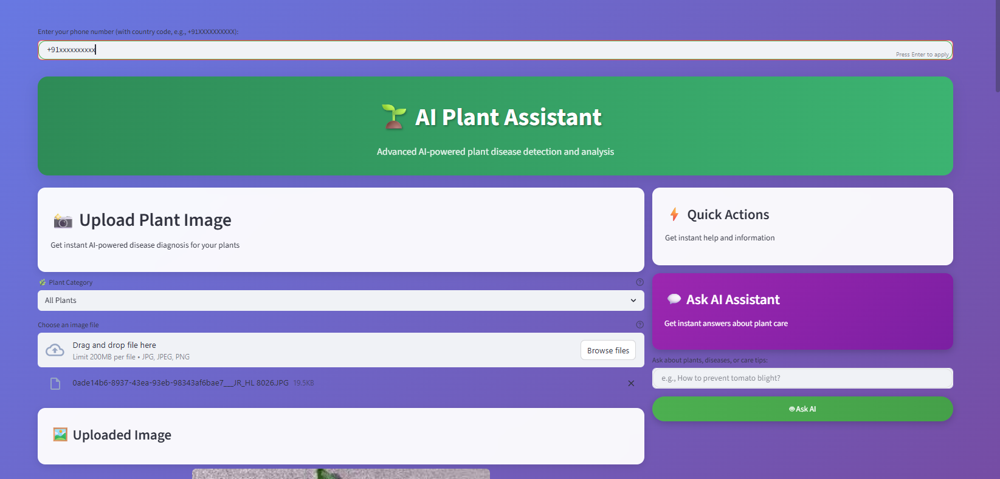
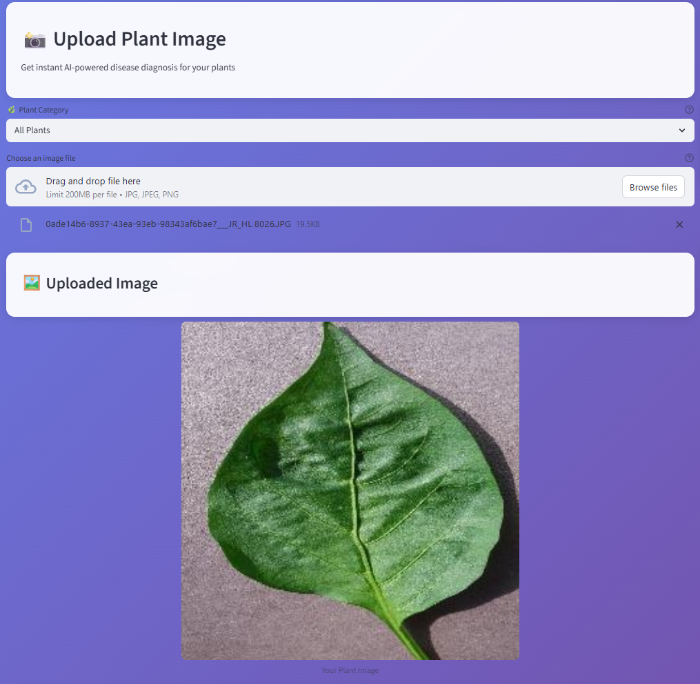
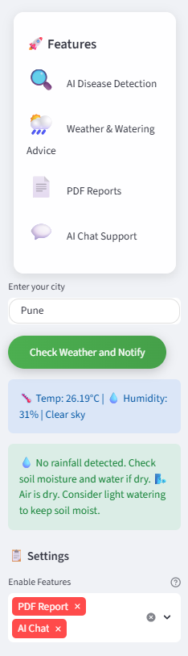
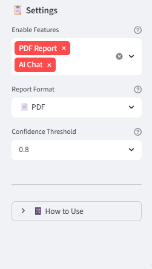
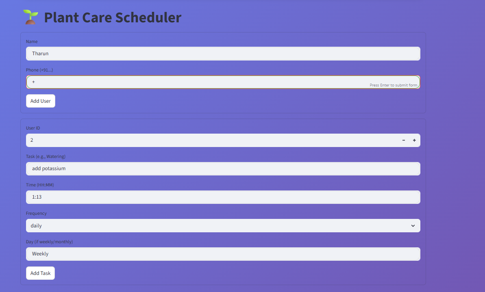
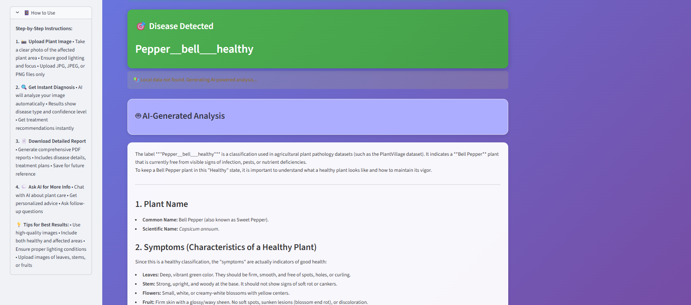
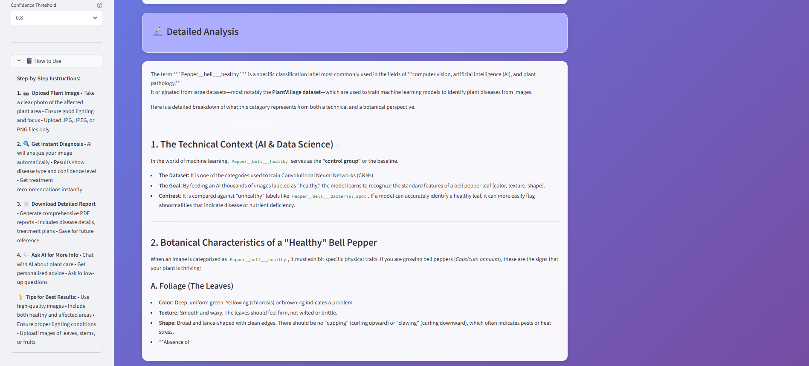

# 🌿 AI Plant Assistant

<p align="center">
  
</p>

An AI-powered web application to detect plant diseases using image classification and Google Gemini AI for detailed insights, reminders, and PDF reporting. Designed for farmers, researchers, and plant enthusiasts to monitor plant health efficiently.

---

## 🚀 Features
- 📸 Upload plant leaf images for disease detection  
- 🧠 Classify diseases using a trained TensorFlow model  
- 🤖 Get detailed AI-generated disease information via Google Gemini AI  
- 📄 Download comprehensive PDF reports  
- ⏰ Receive scheduled reminders for plant care via SMS  
- 💬 Ask follow-up questions using AI assistant  

---

## 🛠️ Tech Stack
- **Frontend & UI:** Streamlit  
- **Backend & ML:** Python, TensorFlow  
- **AI & NLP:** Google Gemini API  
- **Scheduler & Notifications:** APScheduler, Twilio  
- **PDF Reports:** FPDF  
- **Environment Management:** dotenv  
- **Containerization:** Docker & Docker Compose  

---

## 📁 Project Structure


Ai_plant/
├── app/ # PDF generator and helper scripts
├── databases/ # SQLite DB and database utilities
├── models/ # Trained ML models
├── reports/ # Generated reports
├── scripts/ # JSON and helper files
├── trained_model/ # Saved TensorFlow models
├── weather/ # Scheduler & notification system
├── genai.py # Main app entrypoint
├── requirements.txt
├── docker-compose.yml
├── .dockerignore
└── README.md


---

## ⚙️ Setup Instructions

### 1️⃣ Clone the repository
```bash
git clone https://github.com/Jaril02/AI_Plant_Assistant.git
cd AI_Plant_Assistant
2️⃣ Create .env file
GOOGLE_API_KEY=your_google_gemini_key
TWILIO_ACCOUNT_SID=your_twilio_sid
TWILIO_AUTH_TOKEN=your_twilio_auth_token
TWILIO_NUMBER=your_twilio_number
3️⃣ Run Locally
pip install -r requirements.txt
streamlit run genai.py

Run scheduler (optional):

python weather/scheduler.py
4️⃣ Run with Docker
docker-compose up --build
🌐 App: http://localhost:8501
⏰ Scheduler runs automatically
📸 App Screenshots
📤 Upload & Detection
<p align="center">  </p>
🤖 AI Assistant
<p align="center">  </p>
🌦️ Weather & Advice
<p align="center">  </p>
📊 Prediction Confidence
<p align="center">  </p>
⏰ Scheduler System
<p align="center">  </p>
🔍 Disease Detection Results
<p align="center">   </p>
📄 PDF Report Generation
<p align="center">  </p>
📝 Notes
Scheduler checks DB every minute and triggers reminders
PDF reports are stored in reports/
.env is required for API keys
Dataset & models are excluded using .gitignore
🤝 Contributing
Open issues for bugs or ideas
Submit pull requests
Test with Docker before pushing